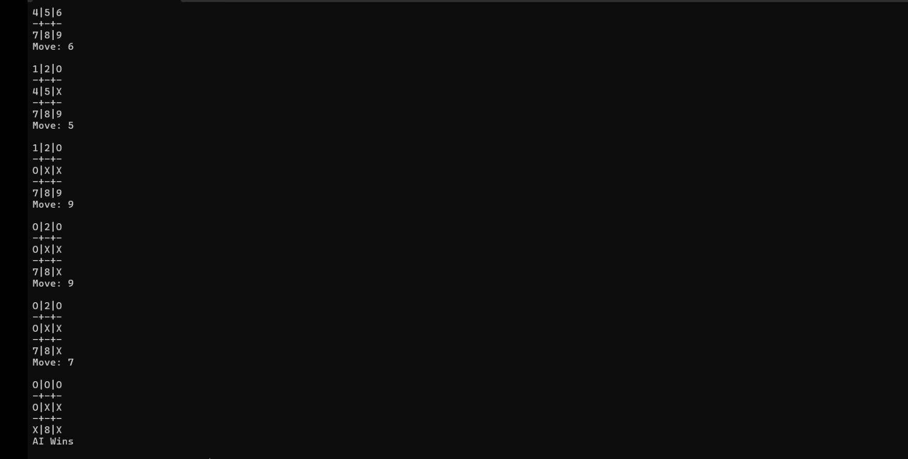
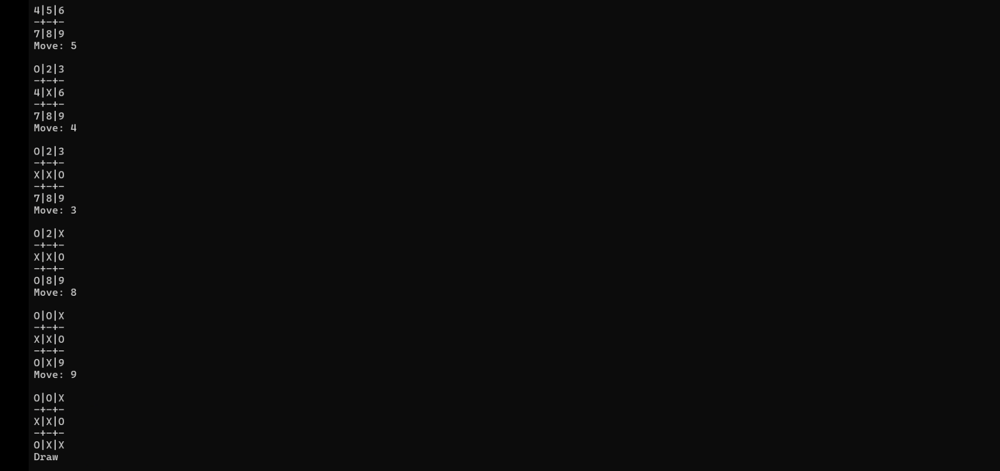

# CODSOFT_TASK2
AI-powered Tic-Tac-Toe game developed in C using the Minimax algorithm.

# Tic-Tac-Toe AI

## Overview

This project is a console-based Tic-Tac-Toe AI developed in C as part of the CodSoft Artificial Intelligence Internship.

The AI uses the **Minimax algorithm** to make optimal moves, providing a challenging gameplay experience.

## Features

- Human vs AI gameplay
- Minimax algorithm implementation
- Winner and draw detection
- Interactive console interface
- Optimal AI moves

## Technologies Used

- C
- GCC Compiler
- Sublime Text
- MSYS2

## How to Run

Compile:

```bash
gcc tic_tac_toe.c -o tic_tac_toe
```

Run:

```bash
./tic_tac_toe
```

## Output

The following screenshots demonstrates the Tic-Tac-Toe AI in action:






## Author

**Shreoshree Mukherjee**
